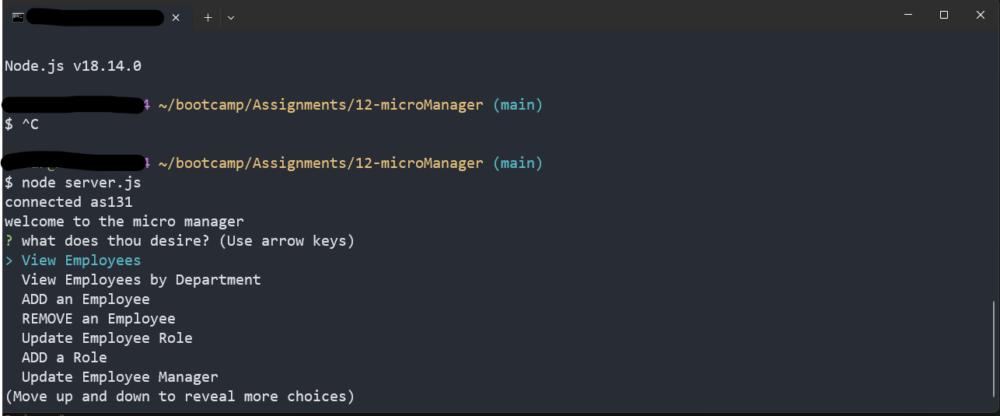
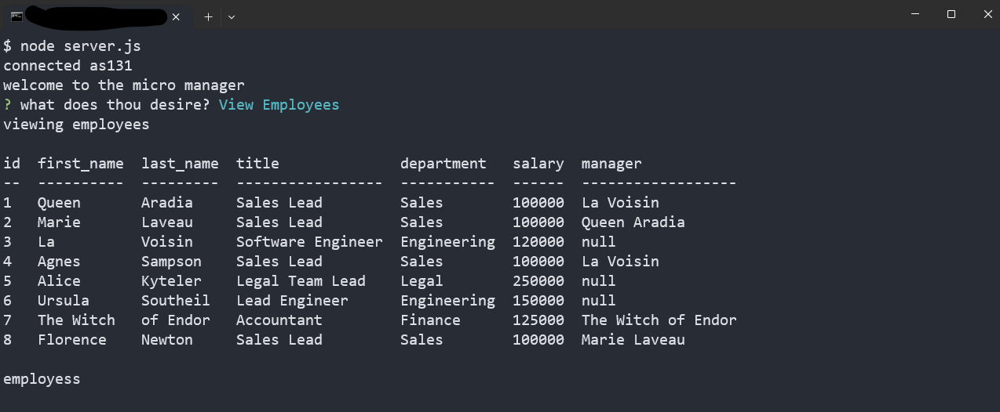
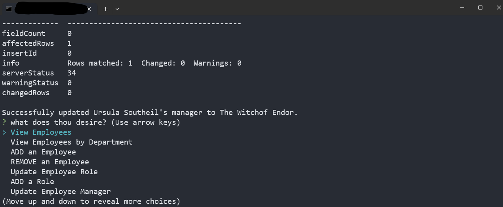
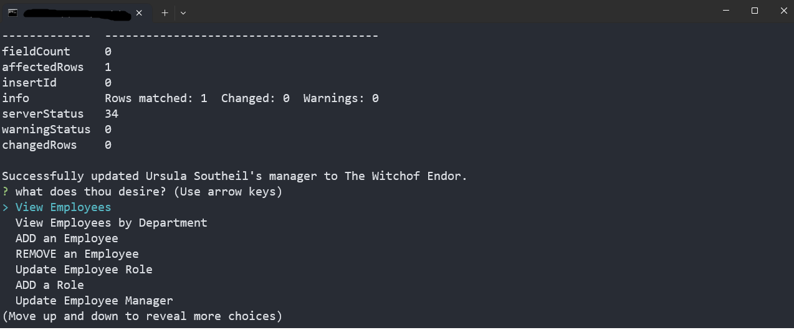

## Command-line microManager✨

[](https://travis-ci.org/joemccann/dillinger)

This is a command-line application that allows users to manage employees, departments, and roles within a company. It is built using Node.js and utilizes the npm packages Inquirer, mysql2, and console.table.






## Installation✨
Clone the repository to your local machine
```sh
Copy code
git clone https://github.com/cmadrid48/microManager.git

Install the required npm packages

Set up the database using the provided schema.sql and seed.sql files

mysql -u <username> -p < schema.sql
mysql -u <username> -p < seed.sql
Note: You will need to have MySQL installed on your machine and have access to a MySQL server in order to set up the database.
```
>make sure to replace your password, and user on server.js!
```sh
const connection = mysql.createConnection({
host: 'localhost',

    port: 3306,

    user: 'root',

    password: '<PASSWORD PLACEHOLDER>',

    database: 'employeesDB'
});
```
## Usage
> Make sure to  replace your credentials in "server.js" to access you mysql!

To start the application, navigate to the project directory in your terminal and enter the following command:

Copy code below, and run in your terminal.
```sh
nmp i
node server.js
```
*make sure you are in you correct directory up running
### You will be presented with a menu of options:✨

- View all departments
- View all roles
- View all employees
- Add a department
- Add a role
- Add an employee
- Update an employee role
- Exit
### Viewing Data✨
When you choose to view departments, roles, or employees, the data will be displayed in a formatted table in your terminal.

### Adding Data✨
When you choose to add a department, role, or employee, you will be prompted to enter the relevant information. Once you have entered the information, it will be added to the database.

### Updating Data✨
When you choose to update an employee's role, you will be prompted to select the employee you wish to update and the new role you want to assign to them. Once you have made your selections, the information will be updated in the database.

### Exiting the Application✨
To exit the application, choose "EXIT(option8)" from the main viewing menu.

## Credits✨
This application was built using Node.js and utilizes the following npm packages:
| Plugin | README |
| ------ | ------ |
Inquirer - https://www.npmjs.com/package/inquirer
mysql2 - https://www.npmjs.com/package/mysql2
console.table - https://www.npmjs.com/package/console.table
## License✨
This project is licensed under the terms of the MIT license.